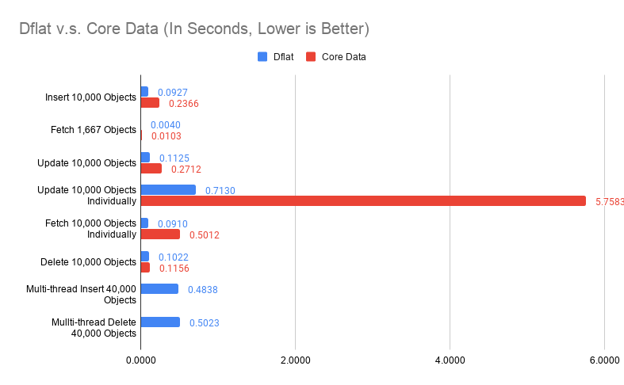
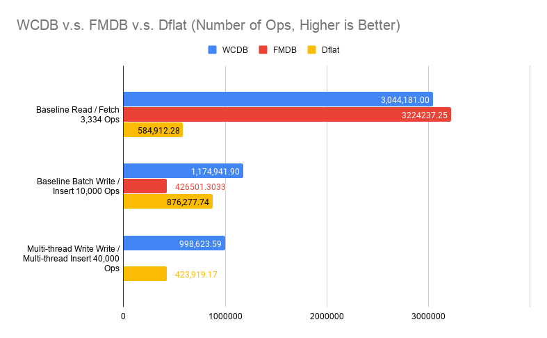
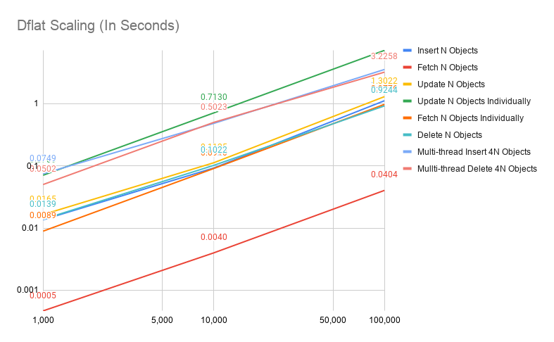
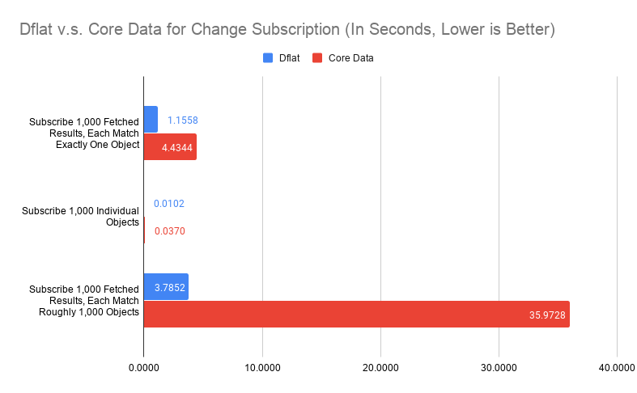

# Dflat: SQLite ❤️  FlatBuffers

[](https://swiftpackageindex.com/liuliu/dflat)
[](https://swiftpackageindex.com/liuliu/dflat)
[](https://travis-ci.org/liuliu/dflat)

If you are familiar with [Core Data](https://developer.apple.com/library/archive/documentation/Cocoa/Conceptual/CoreData/index.html) or [Realm](https://realm.io/), **Dflat** occupies the same space as these two in your application. Unlike these two, **Dflat** has a different set of features and makes very different trade-offs. These features and trade-offs are grounded from real-world experiences in writing some of the world largest apps. **Dflat** is also built from ground-up using Swift and hopefully, you will find it is natural to interact with in the Swift language.

## Features

I've been writing different structured data persistence systems on mobile for the past a few years. **Dflat** is an accumulation of lessons-learned when building these proprietary systems. On iOS particular, the go-to choice long has been **Core Data**. It works, and is the internal data persistence mechanism for many system apps.

But when deploying structured data persistence system to hundreds of millions mobile devices, there are certain challenges, both on the intrinsics of how data is persisted, and on a higher-level how the rest of the app interact with such system.

The **Dflat** codebase is still in a very young stage. However, the underlying principles have been proving successful in other proprietary systems. **Dflat** implemented the following features in no particular order:

 1. The system returns immutable data objects that can be passed down to other systems (such as your view model generators);

 2. All queries and objects can be observed. Updates will be published through either callbacks or Combine framework;

 3. Mutation can only happen on separate threads that caller has little control over, thus, asynchronously;

 4. Data fetching can happen concurrently and synchronously on any thread by caller's choice;

 5. [Strict serializable](https://jepsen.io/consistency/models/strict-serializable) multi-writer / multi-reader mode is supported but users can choose single-writer (thus, trivially strict serializable) / multi-reader mode if they desire;

 6. Data queries are expressed with Swift code, and will be type-checked by the Swift compiler;

 7. Schema upgrades require no write-access to the underlying database (strict read-only is possible with SQLite 3.22 and above).

Unlike **Core Data**, **Dflat** is built from ground-up with Swift. You can express your data model by taking full advantage of the Swift language. Thus, a native support for `struct` (product-type), `enum` (sum-type), with type-checked queries and observing with [Combine](https://developer.apple.com/documentation/combine).

## 30 Seconds Introduction

**Dflat** consists two parts:

 1. `dflatc` compiler that takes a [flatbuffers schema](https://google.github.io/flatbuffers/flatbuffers_guide_writing_schema.html) and generate Swift code from it;

 2. **Dflat** runtime with very minimal API footprint to interact with.

The **Dflat** runtime uses SQLite as the storage backend. The design itself can support other backends such as [libmdbx](https://github.com/erthink/libmdbx) in the future. The only hard dependency is flatbuffers.

To use **Dflat**, you should first use `dflatc` compiler to generate data model from flatbuffers schema, include the generated code in your project, and then use **Dflat** runtime to interact with the data models.

## Installation

**Dflat** at the moment requires [Bazel](https://github.com/bazelbuild/bazel). To be more precise, **Dflat** runtime can be installed with either [Swift Package Manager](https://swift.org/package-manager/) or Bazel. But the `dflatc` compiler requires Bazel to build relevant parts.

You can install Bazel on macOS following [this guide](https://docs.bazel.build/versions/3.3.0/install-os-x.html).

After that, you can use `dflatc` compiler with

```
./dflatc.py --help
```

You can then proceed to add **Dflat** runtime either with Swift Package Manager or Bazel. With Swift Package Manager:

```swift
.package(name: "Dflat", url: "https://github.com/liuliu/dflat.git", from: "0.2.0")
```

## Example

Assuming you have a `post.fbs` file somewhere look like this:

```
enum Color: byte {
  Red = 0,
  Green,
  Blue = 2
}

table TextContent {
  text: string;
}

table ImageContent {
  images: [string];
}

union Content {
  TextContent,
  ImageContent
}

table Post {
  title: string (primary); // This is the primary key
  color: Color;
  tag: string;
  priority: int (indexed); // This property is indexed
  content: Content;
}

root_type Post; // This is important, it says the Post object will be the one Dflat manages.
```

You can then use `dflatc` compiler to generate code from the schema:

```
./dflatc.py -o ../PostExample ../PostExample/post.fbs
```

If everything checks out, you should see 4 files generated in `../PostExample` directory: `post_generated.swift`, `post_data_model_generated.swift`, `post_mutating_generated.swift`, `post_query_generated.swift`. Adding them to your project.

Now you can do basic Create-Read-Update-Delete (CRUD) operations on the `Post` object.

```swift
import Dflat
import SQLiteDflat

let dflat = SQLiteWorkspace(filePath: filePath, fileProtectionLevel: .noProtection)
```

Create:

```swift
var createdPost: Post? = nil
dflat.performChanges([Post.self], changesHandler: { (txnContext) in
  let creationRequest = PostChangeRequest.creationRequest()
  creationRequest.title = "first post"
  creationRequest.color = .red
  creationRequest.content = .textContent(TextContent(text: "This is my very first post!"))
  guard let inserted = try? txnContent.submit(creationRequest) else { return } // Alternatively, you can use txnContent.try(submit: creationRequest) which won't return any result and do "reasonable" error handling.
  if case let .inserted(post) = inserted {
    createdPost = post
  }
}) { succeed in
  // Transaction Done
}
```

Read:

```swift
let posts = dflat.fetch(for: Post.self).where(Post.title == "first post")
```

Update:

```swift
dflat.performChanges([Post.self], changesHandler: { (txnContext) in
  let post = posts[0]
  let changeRequest = PostChangeRequest.changeRequest(post)
  changeRequest.color = .green
  txnContent.try(submit: changeRequest)
}) { succeed in
  // Transaction Done
}
```

Delete:

```swift
dflat.performChanges([Post.self], changesHandler: { (txnContext) in
  let post = posts[0]
  let deletionRequest = PostChangeRequest.deletionRequest(post)
  txnContent.try(submit: deletionRequest)
}) { succeed in
  // Transaction Done
}
```

You can subscribe changes to either a query, or an object. For an object, the subscription ends when the object was deleted. For queries, the subscription won't complete unless cancelled. There are two sets of APIs for this, one is vanilla callback-based, the other is based on [Combine](https://developer.apple.com/documentation/combine). I will show the **Combine** one here.

Subscribe a live query:

```swift
let cancellable = dflat.publisher(for: Post.self)
  .where(Post.color == .red, orderBy: [Post.priority.descending])
  .subscribe(on: DispatchQueue.global())
  .sink { posts in
    print(posts)
  }
```

Subscribe to an object:

```swift
let cancellable = dflat.pulisher(for: posts[0])
  .subscribe(on: DispatchQueue.global())
  .sink { post in
    switch post {
    case .updated(newPost):
      print(newPost)
    case .deleted:
      print("deleted, this is completed.")
    }
  }
```

## Schema Evolution

The schema evolution in **Dflat** Follows exact with flatbuffers. The only exception is that you cannot add more primary keys or change primary key to a different property once it is selected. Otherwise, you are free to add or remove indexes, rename properties. Properties to be removed should be marked as `deprecated`, new properties should be appended to the end of the table, and you should never change the type of a property.

There is no need for versioning as long as you follow the schema evolution path. Because the schema is maintained by flatbuffers, not SQLite, there is no disk ops required for schema upgrade. Schema upgrade failures due to lack of disk space or prolonged schema upgrade time due to pathological cases won't be a thing with **Dflat**.

## Namespace

**Dflat** schema supports namespace, as does flatbuffers schema. However, because Swift doesn't really support proper namespace, the namespace implementation relies on `public enum` and extensions. Thus, if you have namespace:

```
namespace Evolution.V1;

table Post {
  title: string (primary);
}

root_type Post;
```

You have to declare the namespace yourself. In your project, you need to have a Swift file contains following:

```swift
public enum Evolution {
  public enum V1 {
  }
}
```

And it will work. You can then access the `Post` object through `Evolution.V1.Post` or `typealias Post = Evolution.V1.Post`.

## Dflat Runtime API

**Dflat** runtime has very minimal API footprint. There are about 15 APIs in total from 2 objects.

### Transactions

```swift
func Workspace.performChanges(_ transactionalObjectTypes: [Any.Type], changesHandler: @escaping (_ transactionContext: TransactionContext) -> Void, completionHandler: ((_ success: Bool) -> Void)? = nil)
```

The API takes a `changesHandler` closure, where you can perform transactions such as object creations, updates or deletions. These mutations are performed through `ChangeRequest` objects.

The first parameter specifies relevant object you are going to transact with. If you read or update any objects that is not specified here, an assertion will be triggered.

When the transaction is done, the `completionHandler` closure will be triggered, and it will let you know whether the transaction is successful or not.

The transaction will be performed in a background thread, exactly which one shouldn't be your concern. Two different objects can have transactions performed concurrently, it follows strict serializable protocol in that case.

```swift
func TransactionContext.submit(_ changeRequest: ChangeRequest) throws -> UpdatedObject
func TransactionContext.try(submit: ChangeRequest) -> UpdatedObject?
func TransactionContext.abort() -> Bool
```

You can interact with **Dflat** with above APIs in a transaction. It handles data mutations through `submit`. Note that errors are possible. For example, if you created an object with the same primary key twice (you should use `upsertRequest` if this is expected). `try(submit:` method simplified the `try? submit` dance in case you don't want to know the returned value. It will fatal if there are conflict primary keys, otherwise will swallow other types of errors (such as disk full). When encountered any other types of errors, **Dflat** will simply fail the whole transaction. `abort` method will explicitly abort a transaction. All submissions before and after this call will have no effect.

### Data Fetching

```swift
func Workspace.fetch(for ofType: Element.Type).where(ElementQuery, limit = .noLimit, orderBy = []) -> FetchedResult<Element>
func Workspace.fetch(for ofType: Element.Type).all(limit = .noLimit, orderBy = []) -> FetchedResult<Element>
func Workspace.fetchWithinASnapshot<T>(_: () -> T) -> T
```

Data fetching happens synchronously. You can specify conditions in the `where` clause, such as `Post.title == "first post"` or `Post.priority > 100 && Post.color == .red`. The returned `FetchedResult<Element>` acts pretty much like an array. The object itself (`Element`) is immutable, thus, either the object or the `FetchedResult<Element>` is safe to pass around between threads.

`fetchWithinASnapshot` provides a consistent view if you are going to fetch multiple objects:

```swift
let result = dflat.fetchWithinASnapshot { () -> (firstPost: FetchedResult<Post>, highPriPosts: FetchedResult<Post>) in
  let firstPost = dflat.fetch(for: Post.self).where(Post.title == "first post")
  let highPriPosts = dflat.fetch(for: Post.self).where(Post.priority > 100 && Post.color == .red)
  return (firstPost, highPriPosts)
}
```

This is needed because **Dflat** can do transactions in between fetch for `firstPost` and `highPriPosts`. The `fetchWithinASnapshot` won't stop that transaction, but will make sure it only observe the view from fetching for `firstPost`.

### Data Subscription

```swift
func Workspace.subscribe<Element: Equatable>(fetchedResult: FetchedResult<Element>, changeHandler: @escaping (_: FetchedResult<Element>) -> Void) -> Subscription
func Workspace.subscribe<Element: Equatable>(object: Element, changeHandler: @escaping (_: SubscribedObject<Element>) -> Void) -> Subscription
```

The above are the native subscription APIs. It subscribes changes to either a `fetchedResult` or an object. For object, it will end when object deleted. The subscription is triggered before a `completionHandler` on a transaction triggered.

```swift
func Workspace.publisher<Element: Equatable>(for: Element) -> AtomPublisher<Element>
func Workspace.publisher<Element: Equatable>(for: FetchedResult<Element>) -> FetchedResultPublisher<Element>
func Workspace.publisher<Element: Equatable>(for: Element.Type).where(ElementQuery, limit = .noLimit, orderBy = []) -> QueryPublisher<Element>
func Workspace.publisher<Element: Equatable>(for: Element.Type).all(limit = .noLimit, orderBy = []) -> QueryPublisher<Element>
```

These are the **Combine** counter-parts. Besides subscribing to objects or `fetchedResult`, it can also subscribe to a query directly. What happens under the hood is the query will be made upon `subscribe` (hence, on whichever queue you provided if you did `subscribe(on:`), and subscribe the `fetchedResult` from then on.

### Close

```swift
func Workspace.shutdown(completion: (() -> Void)? = nil)
```

This will trigger the **Dflat** shutdown. All transactions made to **Dflat** after this call will fail. Transactions initiated before this will finish normally. Data fetching after this will return empty results. Any data fetching triggered before this call will finish normally, hence the `completion` part. The `completion` closure, if supplied, will be called once all transactions and data fetching initiated before `shutdown` finish.

## Benchmark

Benchmark on structured data persistence system is notoriously hard. **Dflat** won't claim to be fastest. However, it strives to be *predictable performant*. What that means is there shouldn't be any pathological cases that the performance of **Dflat** degrades unexpectedly. It also means **Dflat** won't be surprisingly fast for some optimal cases.

Following data are collected, and can be reproduced from:

```
./focus.py app:Benchmarks
```

I compared mainly against Core Data, and listed numbers for FMDB and [WCDB](https://github.com/Tencent/wcdb) from WCDB Benchmark (from v1.0.8.2) to give a better overview of what you would expect from the test device.

The test device is a iPhone 11 Pro with 64GB memory.

**A Disclaimer**: you should take a grain of salt for any benchmark numbers. These numbers I presented here simply to demonstrate some pathological cases for frameworks involved. It shouldn't be taken out of this context. In practice, structured data persistence systems rarely are the bottle-neck. It is more important to understand how you use it rather than what's the raw numbers in a light-workload device looks like.

The code for `app:Benchmarks` was compiled in Release mode (`--compilation-mode=opt`) with `-whole-module-optimization` on. The WCDB Benchmark was compiled in Release mode whatever that means in their project file.

The benchmark itself is not peer-reviewed. In some cases, it represents the best case scenarios for these frameworks. In other cases, it represents the worst case scenarios. It is not designed to reflect real-world work-load. Rather, these benchmarks designed to reflect the framework's characteristics under extreme cases.

### CRUD

First, we compared **Dflat** against Core Data on object insertions, fetching, updates and deletions. 10,000 objects are generated, with no index (only title indexed in Core Data).

*Fetching 1,667 Objects* evaluated both frameworks on querying by non-indexed property.

*Update 10,000 Objects Individually* evaluated updating different objects in separate transactions 10,000 times.

*Fetching 10,000 Objects Individually* evaluated fetching different objects by title (indexed in Core Data and is the primary key in Dflat) 10,000 times.

These are obviously not the best way of doing things (you should update objects in one big transaction, and fetch them in batch if possible), but these are the interesting pathological cases we discussed earlier.

A proper way of doing multi-thread insertions / deletions in Core Data are considerably more tricky, I haven't got around to do that. The *Multi-thread Insert 40,000 Objects* and *Multi-thread Delete 40,000 Objects* are only for **Dflat**.



Some of these numbers looks too good to be true. For example, on insertions, **Dflat** appears more than twice as fast as Core Data. Some of these numbers didn't make intuitive sense, why multi-thread insertions are slower? Putting it in perspective is important.



The chart compared against numbers extracted from WCDB Benchmark (v1.0.8.2) without any modifications. It compares ops per seconds rather than time spent fetching 33,334 objects. Note that in WCDB Benchmark, Baseline Read did fetch all, which is the best case scenario in SQLite. It also compares a simple table with only two columns, a key and a blob payload (100 bytes).

Multi-thread writes is indeed slower in our ideal case, because SQLite itself cannot execute writes concurrently. Thus, our multi-writer mode really just means these transaction closures can be executed concurrently. The writes still happen serially at SQLite layer. It is still beneficial because in real-world cases, we spend significant time in the transaction closure for data transformations, rather than SQLite writes.

The ceiling for writes is much higher than what **Dflat** achieved. Again, WCDB represents an ideal case where you have only two columns. **Dflat** numbers in real-world would also be lower than what we had here, because we will have more indexes and objects with many fields, even arrays of data.

Since **Dflat** doesn't introduce any optimizations for batch operations, it shouldn't be a surprise that **Dflat** performance scales linearly w.r.t. dataset size, as the follow chart will show.



### Change Subscription

Every framework has slightly different design for how changes subscription works. Core Data implements this in two ways: `NSFetchedResultsController` delegate callbacks, and `NSManagedObjectContextObjectsDidChange`. From developer's perspective, `NSFetchedResultsController` can be interpreted as counter-part for `FetchedResult` subscription on **Dflat** side. Both supports making SQL-like queries and sending updates for the result set. You can build the **Dflat** object subscription mechanism in Core Data based on `NSManagedObjectContextObjectsDidChange` notification. For the purpose of being objective, I will simply observe the latency for `NSManagedObjectContextObjectsDidChange` notification when compare these two, assuming the underlying delivery to individual object subscription is a no-op.

There are three parts of the benchmark:

 1. Subscribe changes to 1,000 fetched results, each observe exactly one object (fetched by the primary key). Subsequent transaction will update 10,000 objects, including these subscribed 1,000 objects. Measuring the latency from when saved, to the time when updates delivered. For Core Data, a child context of viewContext was set up, and the latency was measured before saving the child context, to the time it is delivered. This should be before data persisted (`viewContext.save()` was called after child context saved). On **Dflat** side, this happens after data persisted.

 2. Subscribe changes to 1,000 fetched objects. Subsequent transaction will update 10,000 objects, including these subscribed 1,000 objects. Measuring the latency from when saved, to the time when updates delivered. For Core Data, `NSManagedObjectContextObjectsDidChange` was subscribed for the `viewContext` object. It measures the latency from before saving the child context, to the time notification was delivered.

 3. Subscribe changes to 1,000 fetched results, each observe around 1,000 objects (fetched by a range query). Subsequent transaction will update 10,000 objects, rotate all objects in each fetched results, while maintaining 1,000 objects per result. The measurement setup on Core Data is the same as 1.



The number for both fetched results observation, especially on case 1, represents the most pathological case of them all. It is particularly troublesome for **Dflat** because fetching 1,000 objects from disk individually would take around 20 milliseconds. Thus, if we would take [SQLite.swift](https://github.com/stephencelis/SQLite.swift) approach of *identifying whcih table changed and simply refetch every query on that table*, we could end up more performant. Although for case 3, refetching from disk would definitely be slower (close to 6 seconds for 1,000 queries, each with 1,000 objects).

From the benchmark, Core Data suffered similar problem, while being worse. Again, this is a extreme case. For mobile apps, you should only have handful of query subscriptions, with probably at most thousands of objects for each query, and unsubscribe changes as you navigate away to other pages. These extreme cases hardly realistic, you are not going to see 35-second stutter from Core Data just because there are 10,000 objects updated and you happen to have 1,000 table views need to be updated. In reality, subscribe to individual queries by primary key seems to be a big no-no. If you want to observe individual object, you should just subscribe individual object as case 2 shows.

However, it does expose that our message-sorting-and-delivery mechanism not working as efficiently as we expected. Fundamentally, **Dflat**'s change subscription works best with incremental changes, because we evaluate every changed objects against all fetched request subscriptions related to that object. This design avoids trip to the disk on every transaction, but also relies on a reasonable implementation to evaluate every changed objects efficiently.

A quick test shows that looping over 10,000 objects with 1,000 string equality evaluation in Swift takes about 30 milliseconds. Profile shows majority time was spent on objects retain / release and function calls for Swift runtime. There are two ways to improve:

 1. Current evaluation relies on Swift protocol with associated types. It seems certain Swift usage has higher runtime cost than others. Switching to a better linear scan, either with a interpreted VM or simply optimizing the evaluation procedure, would probably show 5 to 10x improvements.

 2. Algorithmically, it can be improved. Current implementation is naive in a way that we evaluate each object against each subscribed query. From the study of database implementation, we know accelerated data structures can be be helpful. Particularly, each `FieldExpr` in a query can be used to build a sorted set, `Comparable` queries can be accelerated with these sorted sets.

Both are quite doable, while each has its own challenges. For 1, we need to wrestling with Swift runtime, and its behavior can be erratic at times for obvious gains to be possible. Because I am not intended to delegate parts to C, it makes all harder. For 2, while it is not hard to implement, we use 3-value logic internally (to support `isNull` / `isNotNull` queries), that means for every turn, we need to sort with `UNKNOWN`. Having a robust and correct such implementation means to have much more unit tests to feel comfortable. We also need to balance when to linear scan and when to use accelerated data structures because for small number of changes, linear scan could be faster from previous empirical studies.
